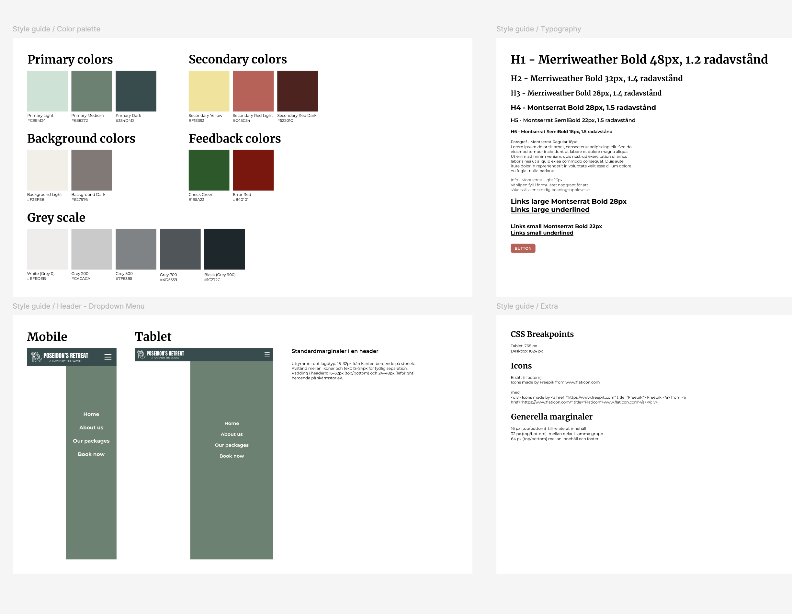
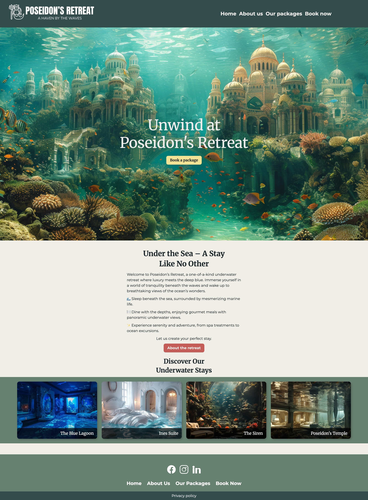

# POSEIDON´S RETREAT

## This project was done as a front-end school assigment for Medieinstitutet Sweden.

The assignment was completed in two teams (see authors). The first team was tasked with designing a responsive and well-defined website of their choice, with an emphasis on consistent colors, typography, and element styling throughout the site. The second team then implemented the design and built the project using Vue as the framework 🚀

### Some of the design elements

  
_Figure 1: The design of the website._

### And the result (one of the pages)

  
_Figure 1: Main view of Poseidon's Retreat._

Techstack used for this project:

## Tech stack

## Authors

### Design team

- [@Frida Nordenlöv](https://github.com/fridanordenlow)

- [@Therese Nielsen](https://github.com/thnielseen)

- [@Elin Nilsson](https://github.com/webbelin)

- [@Emelie Wiberg](https://github.com/Erm0es)

### Development team

- [@Janis Seibutis](https://github.com/JanisSeibutis)

- [@Yuliia Ponomarenko](https://github.com/Yuliia-fed23)

- [@Sarah Sundberg](https://github.com/SarahSu92)

- [@Maria Jonasson](https://github.com/maria-jon)
